# Fluxo desenhavel do app

Este arquivo reflete o fluxo atual do sistema: venda com produtos, entrada de itens para reparo, servicos por item, acompanhamento de status, pagamentos parciais e recibo em PDF.

Voce pode colar os blocos Mermaid em:

- https://mermaid.live
- diagrams.net / draw.io, usando `Insert > Advanced > Mermaid`
- Notion, GitHub ou Markdown Preview com suporte a Mermaid

## Visao geral atual

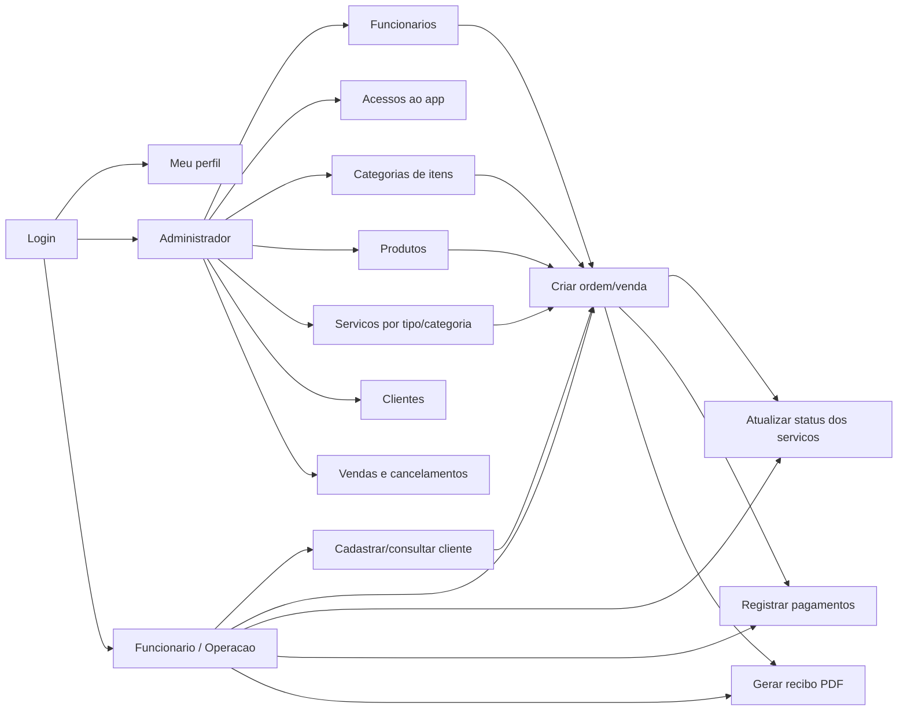

## Fluxo principal da ordem

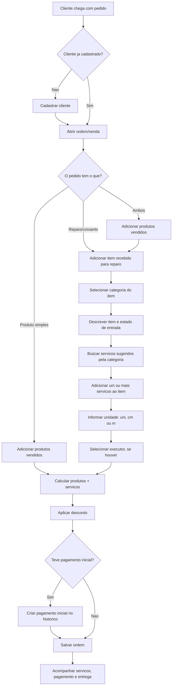

## Detalhe do reparo por item

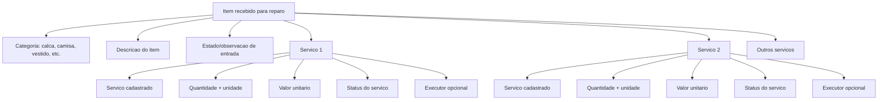

## Sugestao de servicos por categoria

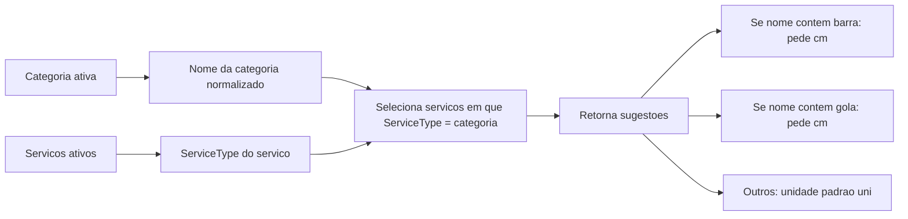

## Regras atuais da criacao da ordem

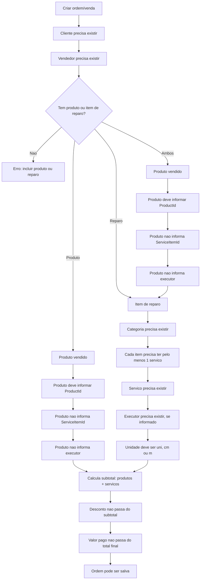

## Status do servico de reparo

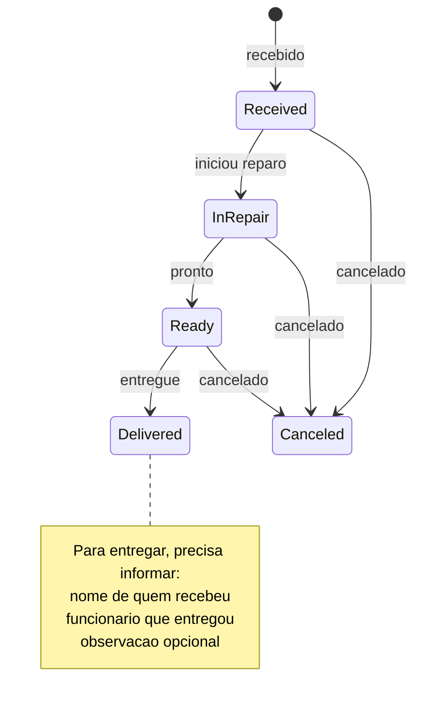

## Status geral da venda

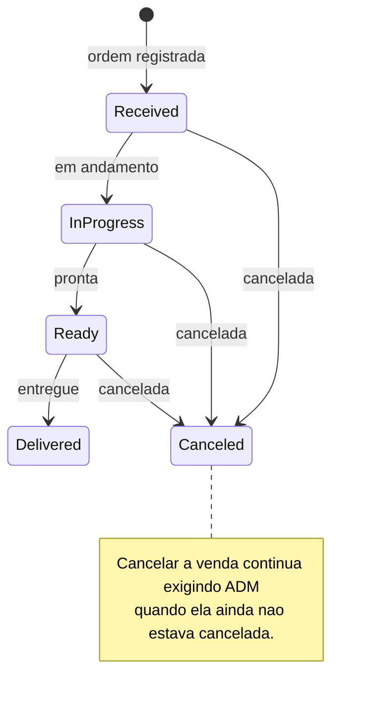

## Pagamentos

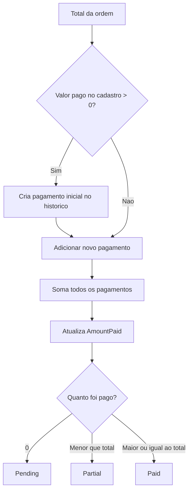

## Recibo PDF

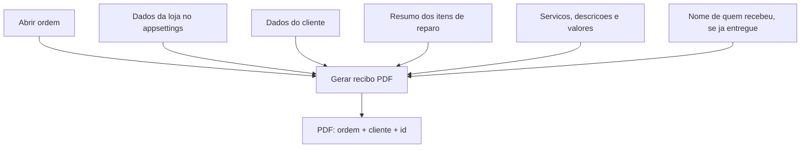

## Mapa dos dados atual

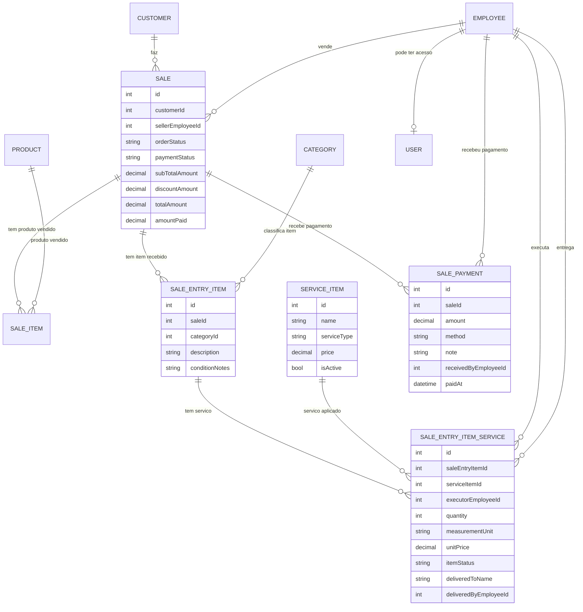

## Quem pode fazer o que

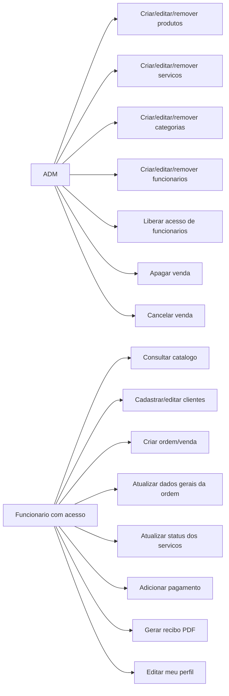

## Pontos para decidir agora

- A palavra na interface deve ser "venda", "ordem", "ordem de servico" ou "atendimento"?
- Produto vendido e item de reparo devem aparecer na mesma tela ou em abas separadas?
- O status geral da venda deve ser automatico conforme os servicos avancam?
- Entrega parcial precisa existir quando uma ordem tem varios itens?
- O pagamento deve bloquear entrega se ainda estiver pendente/parcial?
- O recibo deve incluir produtos vendidos tambem, ou so reparos como esta hoje?
- Quem pode alterar status de servico: qualquer funcionario ou somente o executor/ADM?
- As unidades `uni`, `cm` e `m` sao suficientes?
- As sugestoes por categoria devem ser configuradas pelo nome da categoria ou por um campo fixo?

## Roteiro de apresentacao

1. Fazer login.
2. Mostrar cliente.
3. Mostrar categorias e servicos configurados por tipo.
4. Criar uma ordem com item recebido para reparo.
5. Selecionar categoria e ver servicos sugeridos.
6. Adicionar medidas, executor, desconto e pagamento inicial.
7. Atualizar status do servico: recebido, em reparo, pronto, entregue.
8. Registrar pagamento parcial ou final.
9. Gerar recibo PDF.
10. Perguntar o que ficou estranho para o uso real da loja.
